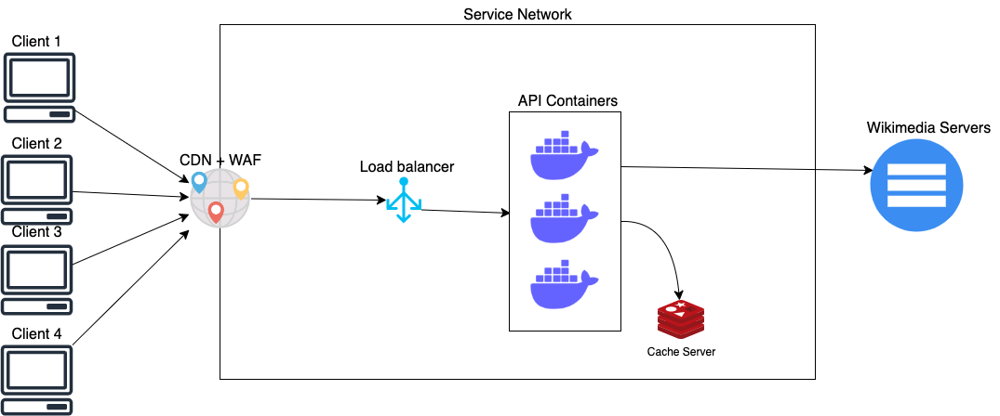

# Short Description API

This repository represents a simple API to get people's data from those whose Wikipedia page exists in English.

## Assumptions made

* In allowance with challenge description, there is no need to take all fields from API's content. In that case, I only picked the name and short description of the output of this designed API.

## About project
* This project has been done in Golang and with Docker. 
* The code has been written using some dependency injection patterns and clean architecture software design.

## How to run this project
###  Requirements
To run this project, you must have installed Docker and Docker Compose.

###  Run command

> docker-compose up -d

### API URL
> **Warning**: This API URL only responds to HTTP **GET** method.

The api URL is http://localhost:18080/api/v1/person/<name> where token `<name>` should be substituted by the interested person’s name.


## API output schema
After you started docker-compose on previous section a `swagger-ui` will be available on address http://localhost:8080/.

### Find a person successfully
The API will return a http status **200** and will return some information.

### Person not found on Wikimedia API
When someone is not found on Wikimedia API it will return an HTTP status **404** and a body message like the following:


```json
{
  "code": 404,
  "type": "entity_not_found",
  "message": "entity is not found"
}
```

### Person is found but there is no short description on Wikimedia API
When someone is found on Wikimedia API, it will return an HTTP status of **200**, and the body field which contains `short_description` will be null.

## Scaling on a real scenario
To avoid constantly hitting the Wikimedia API and not suffer if the API fails, I designed a Redis cache server to cache the data from Wikimedia for a desired amount of time TBD by the business.
And at the other side, I want to use a CDN to cache the response from API because the data is not changed too frequently, and it helps our system on heavy usage cycles.



